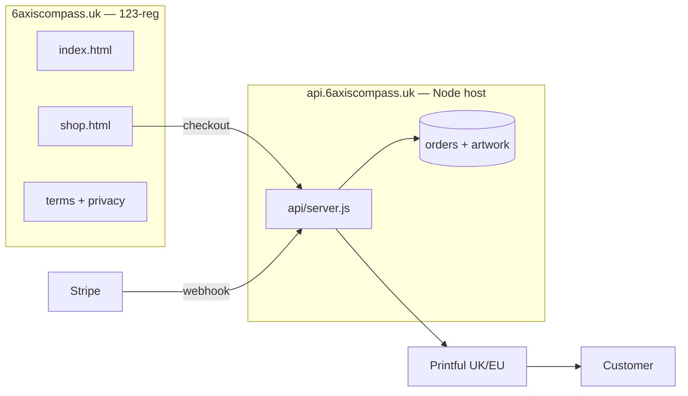

# Merch — infrastructure prerequisites

Planning reference only. **Not a deploy runbook** — see [`merch-deploy.md`](merch-deploy.md) and [`hosting-123-reg.md`](hosting-123-reg.md) when you go live.

Live Printful merch needs **more than static hosting**. The compass quiz can run as HTML on GitHub Pages or 123-reg; checkout and fulfilment cannot.

## Why static hosting is not enough

| Capability | Static site (Pages / 123-reg shared) | Required for live merch |
|------------|--------------------------------------|-------------------------|
| Quiz + shop preview | Yes | Yes |
| Stripe Checkout session | No | Node API |
| Stripe webhook (payment confirmed) | No | Always-on HTTPS endpoint |
| Server-side chart PNG (print DPI) | No | Node + sharp |
| Artwork URL for Printful | No | Disk or object storage |
| Order records + idempotency | No | Persistent store |
| API secrets | Must not be in static files | Host env vars only |

Printful pulls artwork from a **public HTTPS URL** at order time. GitHub Pages cannot run that pipeline or receive webhooks.

## Component inventory

What you must provision (or subscribe to) before taking money:

### 1. Public static site

- **Purpose:** Quiz, dataset, shop UI, terms/privacy pages
- **Future objective:** `https://6axiscompass.uk` (123-reg)
- **Interim:** GitHub Pages is fine for prototype; **not** the long-term home for a commercial shop (ToS and product fit)
- **Build:** `MERCH_API_BASE=https://api.6axiscompass.uk npm run build` then upload `dist/`

### 2. Checkout API (Node)

- **Purpose:** `POST /api/checkout/session`, `POST /api/webhooks/stripe`, chart render, Printful order
- **Code:** [`api/server.js`](../api/server.js) and [`api/lib/merch-orders.js`](../api/lib/merch-orders.js)
- **Host:** Node-capable PaaS or VPS — **not** typical 123-reg shared hosting
- **Future objective:** `https://api.6axiscompass.uk` (e.g. Fly.io in `lhr`, or 123-reg VPS)
- **Requirements:** HTTPS, stable URL, process stays up for webhooks

### 3. Artwork + order storage

- **Purpose:** PNG files Printful fetches; order JSON for idempotency and support
- **Code:** [`api/lib/artwork-storage.js`](../api/lib/artwork-storage.js), [`api/lib/order-store.js`](../api/lib/order-store.js)
- **v1 default:** Local disk on API host (Fly volume or VPS path)
- **Scale path:** S3-compatible bucket (R2/S3) via `MERCH_ARTWORK_STORAGE=s3`

### 4. Third-party accounts

| Service | Role |
|---------|------|
| **Stripe** | Payment + shipping address collection |
| **Printful** | Print, pack, ship (UK/EU nodes) |
| **Domain/DNS** | `6axiscompass.uk`, `api.6axiscompass.uk` |

Manual setup: Printful product selection, real `variant_id`s in [`api/config/printful-catalog.json`](../api/config/printful-catalog.json), sample orders — see [`merch-printful-catalog.md`](merch-printful-catalog.md).

### 5. Secrets (API host only)

Never commit or embed in static build:

- `STRIPE_SECRET_KEY`, `STRIPE_WEBHOOK_SECRET`
- `PRINTFUL_API_KEY`
- Storage credentials (if using S3/R2)

See [`.env.example`](../.env.example).

### 6. Legal / policy pages

Hosted with the static site: `merch-terms.html`, `merch-privacy.html` (included in `dist/` build).

## Architecture (target production)

## Compass-only vs compass + merch

| | Compass only | + Printful merch |
|--|--------------|------------------|
| Hosting | Static (Pages or 123-reg) | Static **+** Node API subdomain |
| Monthly infra cost | Domain + cheap web hosting | + API host (often low on Fly/Railway) |
| Transaction fees | None | Stripe + Printful COGS |
| Ongoing ops | Upload new `dist/` | Webhooks, failed orders, catalog/price updates |
| GitHub Pages fit | Good | Poor for **production shop** (commercial use; no backend) |

## Implemented in repo vs still external

| Item | In `feat/merch` | You provision separately |
|------|-----------------|---------------------------|
| Shop UI + checkout redirect | Yes | — |
| Checkout + webhook routes | Yes | Stripe dashboard, webhook URL |
| Printful client | Yes | Printful account, API key, variant IDs |
| Chart/mug render pipeline | Yes | — |
| Artwork storage (local/S3) | Yes | Disk volume or bucket |
| Order store (JSON file) | Yes | Persistent volume on API host |
| Sample orders / catalog review | Docs | Manual |
| 6axiscompass.uk static host | Docs | 123-reg (future objective) |
| Monitoring / alerts | Not in v1 | Optional later |

## Optional later (out of v1)

- Printful webhooks (`package_shipped`, `order_failed`)
- Production CORS lock to `6axiscompass.uk` only
- Object storage instead of API disk
- Order status email / admin dashboard
- Auto-refund on Printful failure

## Related docs

- Integration overview: [`merch-printful-integration.md`](merch-printful-integration.md)
- Product catalog + samples: [`merch-printful-catalog.md`](merch-printful-catalog.md)
- API deploy steps: [`merch-deploy.md`](merch-deploy.md)
- Static site on domain: [`hosting-123-reg.md`](hosting-123-reg.md)
