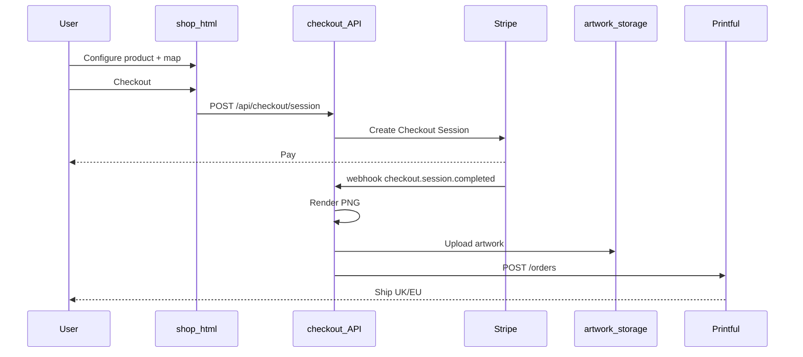

# Merch — Printful integration

Live checkout on branch **`feat/merch`**: Stripe Checkout + Printful fulfilment for apparel and mugs.

**User guide:** [`merch-prototype.md`](merch-prototype.md)  
**Product catalog:** [`merch-printful-catalog.md`](merch-printful-catalog.md)  
**Infrastructure prerequisites:** [`merch-infrastructure.md`](merch-infrastructure.md) — planning; read before go-live  
**Deployment:** [`merch-deploy.md`](merch-deploy.md)

## Architecture

## API routes

| Route | Method | Purpose |
|-------|--------|---------|
| `/api/checkout/session` | POST | Create Stripe Checkout session |
| `/api/webhooks/stripe` | POST | Fulfil paid orders |
| `/api/merch/prices` | GET | Live GBP prices from catalog |
| `/api/orders/:id` | GET | Order status |
| `/api/artwork/:file` | GET | Local artwork files (dev/small deploy) |
| `/api/chart` | POST | Extended with `background`, `labelMerch` |

## Environment

See [`.env.example`](../.env.example). Required for live checkout:

| Variable | Purpose |
|----------|---------|
| `STRIPE_SECRET_KEY` | Checkout sessions |
| `STRIPE_WEBHOOK_SECRET` | Webhook verification |
| `PRINTFUL_API_KEY` | Order submission |
| `MERCH_SUCCESS_URL` / `MERCH_CANCEL_URL` | Stripe redirect URLs |
| `MERCH_ARTWORK_PUBLIC_ORIGIN` | Public base for Printful file fetch |
| `MERCH_API_BASE` | Build-time: shop → API URL |

## Catalog

Variant IDs: [`api/config/printful-catalog.json`](../api/config/printful-catalog.json)

## Chart renderer

[`api/lib/chart-renderer.js`](../api/lib/chart-renderer.js) supports:

- `background`: `white` | `transparent` | `dark`
- `labelMerch`: larger trigram font
- Mug layout: [`api/lib/mug-renderer.js`](../api/lib/mug-renderer.js)

## Client

- [`src/shop-ui.js`](../src/shop-ui.js) — configurator + Stripe redirect
- [`src/merch-checkout.js`](../src/merch-checkout.js) — checkout payload
- v3 hash includes `;ms=` for mug size

## Git workflow

All integration work on **`feat/merch`**. Merge to `main` when ready; production target is **6axiscompass.uk** (not GitHub Pages for live shop). Tag `merch-v1.0.0` at launch.

## References

- [Printful API](https://developers.printful.com/)
- [Printful UK](https://www.printful.com/uk/api)
- [Stripe Checkout](https://stripe.com/docs/checkout)
