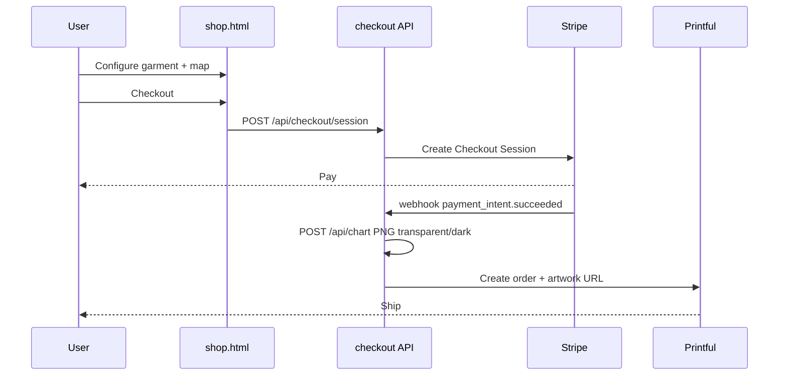

# Merch — Printful integration (future)

The **merch-shop** prototype (`shop.html`) is UI-only: checkout opens a stub modal. This document outlines wiring **Printful** (UK/EU fulfilment) and **Stripe** when moving to production.

**User guide (local demo, v3 URLs, file map):** [`merch-prototype.md`](merch-prototype.md).

## Prototype state

| Piece | Status |
|-------|--------|
| Results merch carousel | Live in `src/ui.js` |
| `shop.html` configurator | Live |
| v3 hash + `sessionStorage` draft | `src/merch-url.js` |
| Checkout | Stub modal (`src/merch.js` → `openCheckoutStubModal`) |
| Printful API | [`api/lib/printful-stub.js`](../api/lib/printful-stub.js) throws until implemented |

## Target flow

## Environment (future)

| Variable | Purpose |
|----------|---------|
| `PRINTFUL_API_KEY` | Printful REST API |
| `STRIPE_SECRET_KEY` | Stripe Checkout |
| `STRIPE_WEBHOOK_SECRET` | Verify webhooks |
| `MERCH_ARTWORK_BASE_URL` | Signed URLs for PNGs Printful fetches |

## API additions (Phase 2)

1. **`POST /api/checkout/session`** — body: merch config (scores, actor slugs, garment SKU, size, colour). Returns Stripe Checkout URL.
2. **Stripe webhook** — on success: render print file via existing `POST /api/chart` with `theme: dark|light|transparent`, upload to object storage, call Printful `POST /orders`.
3. **Printful catalog** — map `tee` / `sweatshirt` / `hoodie` + size to Printful `variant_id` (maintain in config JSON).

## Chart renderer gaps

[`api/lib/chart-renderer.js`](../api/lib/chart-renderer.js) currently forces a white background for print. Black garments need `theme: dark` or `background: transparent` before production DTG.

## Client changes

Replace `openCheckoutStubModal` with redirect to Stripe Checkout URL. Keep v3 hash for post-payment “order status” page (optional).

## References

- [Printful API](https://developers.printful.com/)
- [Printful UK](https://www.printful.com/uk/api)
- Prototype branch: `merch-shop`
